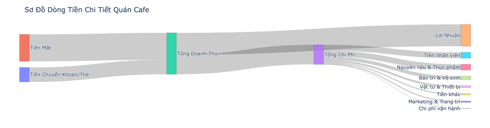

# Automated Expense Categorization & Reporting for Monatea Cafe

This project uses a machine learning model to automatically categorize daily expenses from raw text notes, aggregates financial data, and generates analytical reports and visualizations.

## 🎯 Project Overview
The goal of this project is to automate the tedious manual process of tracking and categorizing daily cafe expenses. The system takes raw, unstructured notes from a manager's spreadsheet, uses Natural Language Processing (NLP) to classify each expense, and produces a clear financial summary, saving time and reducing human error.

## ✨ Key Features
* **Automated Categorization:** A Logistic Regression model trained on custom data categorizes expenses with ~88% accuracy.
* **Data Cleaning:** Robust functions to parse messy, multi-line text entries and extract monetary values.
* **Financial Analysis:** Automatically calculates total revenue, costs by category, and profit/loss.
* **Interactive Visualizations:** Generates Sankey diagrams and Treemaps with Plotly to visualize the flow of money.
* **Google Sheets Integration:** Fetches raw data from and can append processed data back to Google Sheets.

## Google Sheets
* A Google Spreadsheet file that the manager can enter the daily revenue report by cash, this will update the owner master spreadsheet as well

  
* A Google Spreadsheet for the owner to calculate the Total Revenue, Total Cost and Total Profit with some automation features like:
  
      **Automatically format the number entry to Vietnamese Dong (Multiply by 1000 Dong)
      **Automatically generate the days in the current month

## 🛠️ Tech Stack
* **Python:** 3.9+
* **Libraries:** Pandas, Scikit-learn, Joblib, Plotly, Gspread, Matplotlib
* **Development Environment:** Google Colab

## 🚀 The Workflow
This flowchart illustrates the complete data pipeline from raw data to final report.

## 📂 How to Run
1.  **Clone the repository:**
    `git clone https://github.com/your-username/cafe-expense-automation.git`
2.  **Install dependencies:**
    `pip install -r requirements.txt`
3.  **Set up Google API Credentials:**
    Follow the `gspread` authentication guide to create and add your `credentials.json` file to the root directory. Make sure this file is listed in `.gitignore`.
4.  **Train the Model (Run Once):**
    Open and run the `notebooks/1_train_model.ipynb` notebook to train the model and save the artifacts to the `saved_model/` directory.
5.  **Run the Report:**
    Open and run the `notebooks/2_run_report_and_sankey.ipynb` notebook to fetch data, make predictions, and generate the final analysis.

## 📊 Results
The final model achieved **87.88% accuracy** on the test set. It is highly effective at categorizing most expenses, with a known weakness in the rare "Chi phí vận hành" category due to limited data.

